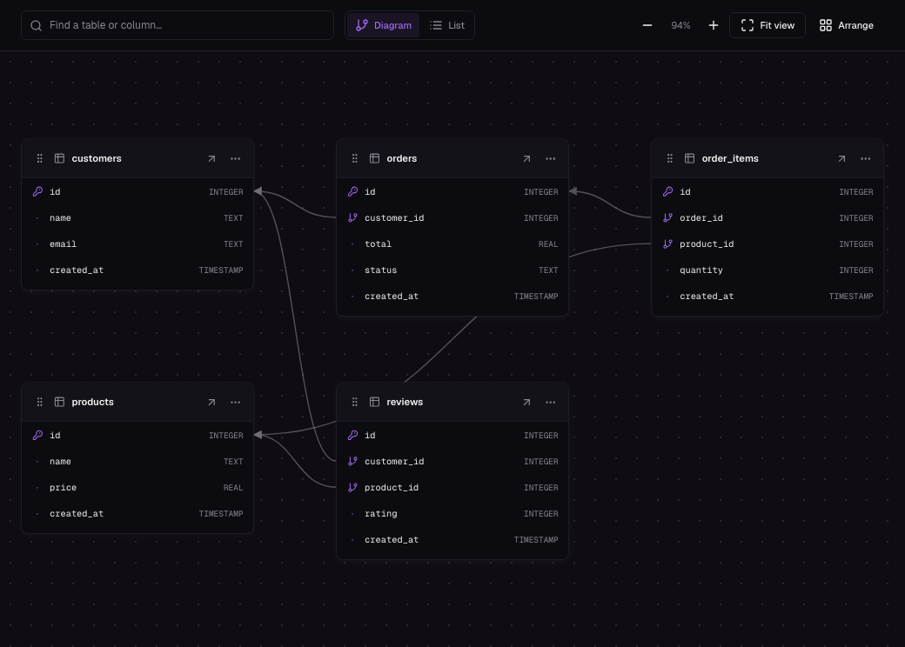

# Nebula Frontend

The web frontend for [Nebula](https://github.com/Annany2002/nebula-backend), an open-source Backend-as-a-Service built with Go and SQLite. Built with React and TypeScript, it provides the interface for managing databases, schemas, records, and application connections.

## Features

- **Projects:** create and delete databases, search and sort projects, switch between grid and list views, and copy connection examples.
- **Table editor:** insert, edit, and delete records; paginate and sort; search the loaded page; choose visible columns; inspect and edit the schema.
- **Schema management:** create tables with foreign keys, add/rename/drop columns, and rename tables.
- **Schema visualizer:** draggable table cards, foreign-key connections, pan/zoom, fit view, automatic layout, search, and a list view.
- **SQL editor:** run SQL with Ctrl/Cmd + Enter, browse table columns, inspect results and execution time, and copy results as TSV.
- **Database objects:** browse tables, indexes, triggers, and SQL definitions.
- **Database exports:** download a SQLite snapshot or SQL dump, preview SQL, and copy it.
- **App connections:** REST, Node.js, Python, and SDK examples with copy controls.
- **Account and keys:** signup/login, profile editing, and database API key generation, rotation, and revocation.
- **Themes and accessibility:** light/dark/system appearance, responsive layouts, keyboard controls, and reduced-motion support.

Record search operates on the current page. The backend separately supports column equality filters through the records API. The Exports page does not provide scheduled backups or a restore workflow.

### Schema relationships

Explore foreign-key relationships, move tables to clarify the layout, and inspect their columns without leaving the database workspace.



## Local setup

You need Node.js/npm and a running [Nebula backend](https://github.com/Annany2002/nebula-backend#quick-start). The backend defaults to `http://localhost:8080`.

```bash
git clone https://github.com/Annany2002/nebula-frontend.git
cd nebula-frontend
npm install
printf 'VITE_BACKEND_URL=http://localhost:8080\n' > .env.local
npm run dev
```

Open [http://localhost:3000](http://localhost:3000). Sign up, log in, create a database, and open its database workspace.

### Configuration

| Variable           | Purpose                                                    | Default                                                    |
| ------------------ | ---------------------------------------------------------- | ---------------------------------------------------------- |
| `VITE_BACKEND_URL` | Backend origin, without `/api/v1`                          | `http://localhost:8080`                                    |
| `VITE_DOCS_URL`    | Public documentation URL, including the desired entry page | `https://kaizer-0109.mintlify.site/api-reference/overview` |

The desktop navbar, mobile menu, and footer open the published [API reference](https://kaizer-0109.mintlify.site/api-reference/overview) by default. To use another documentation site or a local preview, override `VITE_DOCS_URL` in `.env.local` or your hosting provider's build environment.

The documentation source and Mintlify publishing instructions live in the [backend docs directory](https://github.com/Annany2002/nebula-backend/tree/main/docs). Mintlify hosts the documentation independently of the API and frontend.

Restart Vite after changing environment variables. Configure backend `ALLOWED_ORIGINS` to include the frontend origin. Vite environment variables are public client configuration; do not put passwords or private server secrets in them.

The frontend uses JWT Bearer authentication for account and database operations. Generating, rotating, or revoking an API key also uses the account JWT; database keys are intended for your application connections.

## Development

| Command                 | Purpose                                             |
| ----------------------- | --------------------------------------------------- |
| `npm run dev`           | Start Vite on port 3000                             |
| `npm run check`         | Run type checking, ESLint, and Prettier checks      |
| `npm run typecheck`     | Check application TypeScript without emitting files |
| `npm run typecheck:all` | Check application and Vite configuration projects   |
| `npm run lint`          | Run ESLint                                          |
| `npm run format:check`  | Check formatting                                    |
| `npm run preview`       | Preview an existing production bundle               |

Verify UI changes in both themes and at desktop and mobile widths. Check keyboard navigation, loading/error/empty states, and reduced motion. Use `npm run check` for development verification.

### Production build

Set `VITE_BACKEND_URL` for your deployment in `.env.production.local` or the hosting provider's build environment. Set `VITE_DOCS_URL` only if you want to override the public documentation URL, then run `npm run build` when preparing a release. The bundle is written to `dist/`.

Configure SPA fallback so direct links to application routes serve `index.html`. The repository includes `vercel.json` for Vercel routing.

## Application structure

```text
src/
├── App.tsx              # Routes and providers
├── context/             # Account session
├── hooks/queries.ts     # TanStack Query API hooks
├── lib/                 # Configuration and shared helpers
├── pages/               # Landing, authentication, Projects, database workspace, profile, 404
├── components/
│   ├── Studio/          # Navigation, SQL, visualizer, records, objects, exports
│   ├── Table/           # Table creation and schema editing
│   ├── Database/        # Database cards and dialogs
│   └── ui/              # Shared Radix-based UI components
└── styles/              # Landing and database workspace styles
```

## Routes

Database, project, and profile routes require login.

| Route                                    | View                   |
| ---------------------------------------- | ---------------------- |
| `/`                                      | Landing page           |
| `/sign-in`, `/sign-up`                   | Account authentication |
| `/dashboard/:userId`                     | Projects               |
| `/profile`                               | Account profile        |
| `/databases/:db_name/overview`           | Database overview      |
| `/databases/:db_name/tables/:table_name` | Table editor           |
| `/databases/:db_name/sql`                | SQL editor             |
| `/databases/:db_name/visualizer`         | Schema visualizer      |
| `/databases/:db_name/database/tables`    | Table inventory        |
| `/databases/:db_name/database/indexes`   | Indexes                |
| `/databases/:db_name/database/triggers`  | Triggers               |
| `/databases/:db_name/database/backups`   | Exports                |
| `/databases/:db_name/apikeys`            | API keys               |
| `/databases/:db_name/settings`           | Database settings      |

The exports route retains the `backups` URL segment. Derive active workspace tabs from route segments, so `/databases/...` does not accidentally match every database tab.

## Stack

React 18 · TypeScript · Vite 5/SWC · Tailwind CSS 3 · Radix/shadcn UI · TanStack Query · React Router 6 · Framer Motion · React Hook Form/Zod · Sonner.

## Contributing and license

See [CONTRIBUTING.md](CONTRIBUTING.md). This project is [MIT licensed](LICENSE).
